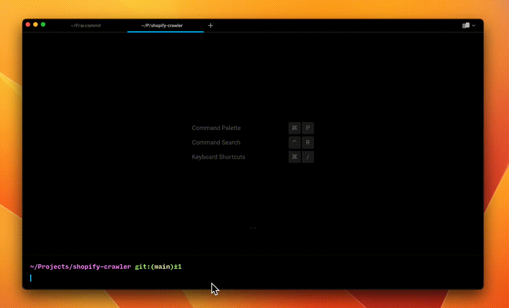

[](https://www.producthunt.com/posts/ai-commit-2)


[](https://youtu.be/7cVU3BuNpok)

[View Demo](https://youtu.be/7cVU3BuNpok)


# ai-commit

> No more headaches with commit messages.

AI-Commit is a command line tool that uses OpenAI's ChatGPT model to generate commit messages for your Git repositories. As a result, you can write meaningful commit messages without having to think about them.

## Prerequisites

To use AI-Commit, you need to obtain an API key from OpenAI and set it as the value of the `OPENAI_API_KEY` environment variable.

```
export OPENAI_API_KEY=sk-xxxxxxxxxxxxxxxxxxxxxxxxxxxxxxxxxxxxxxxx
```

Sometime, the ChatGPT's response is not good (too long, too short, not meaningful). In that case, you can try custom the system prompt by set the `AI_COMMIT_SYSTEM_PROMPT` environment variable:

```
export AI_COMMIT_SYSTEM_PROMPT="You are a GitCommitGPT-4, You will help user to write commit message, commit message should be short (less than 100 chars), clean and meaningful. Only response the message."
```

By default, ai-commit use model `gpt-3.5-turbo`. You can change it by set the `AI_COMMIT_MODEL` environment variable:

```
export AI_COMMIT_MODEL="gpt-3.5-turbo"
```

Note: Using AI-Commit will result in charges from OpenAI for API usage, so be sure to understand their pricing model before use.

## Install

There are two ways to install AI-Commit:

### Use go

```bash
go install github.com/nguyenvanduocit/ai-commit@latest
```

### Prebuilt binaries

You can download prebuilt binaries for Linux, macOS, and Windows from the [releases page](https://github.com/nguyenvanduocit/ai-commit/releases)

## Usage

1. Stage the changes you want to commit in Git.
2. Run `ai-commit` command.
3. The tool will generate a commit message and print it to the console.
4. Now you can chat with the AI to adjust the commit message. Press ctrl + c to stop.
5. Finally, select the type of commit.

## Tip

It's recommended to make multiple small commits, commit more often.

Adjustment must be a list of adjectives to describe the commit message. Default adjustment is "short, simple, and clear"

## Todo

- [ ] Auto split changes in to multiple commits.
- [ ] Detect commit type.
- [ ] Auto tags??

## License

AI-Commit is released under the MIT license. See LICENSE for more information.

## Contributing

Contributions are welcome! Please read the [contribution guidelines](CONTRIBUTING.md) first.

[](https://twitter.com/duocdev)
